# Thai Sign Language (TSL) AI Platform — Comprehensive UI & Architecture Review

เอกสารรวบรวมข้อมูลโครงสร้าง UI, Design Tokens, Component Tree, Component Files, และ Responsive Layout สำหรับส่งต่อให้ AI / Reviewer ตรวจสอบ

---

## 1. ข้อมูล Component Files ที่เกี่ยวข้องกับแต่ละหน้า (Page & Component Mapping)

### หน้าหลัก (Home Page — `/`)
- **Page File**: [`src/app/page.tsx`](file:///d:/TSL/src/app/page.tsx)
- **Layout**: [`src/app/layout.tsx`](file:///d:/TSL/src/app/layout.tsx), [`src/components/layout/AppLayout.tsx`](file:///d:/TSL/src/components/layout/AppLayout.tsx)
- **Header & Navigation**: [`src/components/layout/Navbar.tsx`](file:///d:/TSL/src/components/layout/Navbar.tsx)
- **Footer**: [`src/components/layout/Footer.tsx`](file:///d:/TSL/src/components/layout/Footer.tsx)
- **UI Components**:
  - [`src/components/ui/Button.tsx`](file:///d:/TSL/src/components/ui/Button.tsx)
  - [`src/components/ui/Badge.tsx`](file:///d:/TSL/src/components/ui/Badge.tsx)
  - [`src/components/ui/StatisticsCard.tsx`](file:///d:/TSL/src/components/ui/StatisticsCard.tsx)
  - [`src/components/ui/CategoryCard.tsx`](file:///d:/TSL/src/components/ui/CategoryCard.tsx)
  - [`src/components/ui/Card.tsx`](file:///d:/TSL/src/components/ui/Card.tsx)

---

### หน้าบทเรียน (Lessons Page — `/lessons` & `/lessons/[lessonId]`)
- **Page Files**:
  - [`src/app/lessons/page.tsx`](file:///d:/TSL/src/app/lessons/page.tsx)
  - [`src/app/lessons/[lessonId]/page.tsx`](file:///d:/TSL/src/app/lessons/[lessonId]/page.tsx)
- **Components**:
  - [`src/components/lessons/LessonGrid.tsx`](file:///d:/TSL/src/components/lessons/LessonGrid.tsx)
  - [`src/components/lessons/LessonDetailCard.tsx`](file:///d:/TSL/src/components/lessons/LessonDetailCard.tsx)
  - [`src/components/ui/Card.tsx`](file:///d:/TSL/src/components/ui/Card.tsx)
  - [`src/components/ui/Badge.tsx`](file:///d:/TSL/src/components/ui/Badge.tsx)
  - [`src/components/ui/Button.tsx`](file:///d:/TSL/src/components/ui/Button.tsx)

---

### หน้าพจนานุกรมภาษามือ (Dictionary Page — `/dictionary`)
- **Page File**: [`src/app/dictionary/page.tsx`](file:///d:/TSL/src/app/dictionary/page.tsx)
- **Components**:
  - [`src/components/dictionary/DictionarySearchBar.tsx`](file:///d:/TSL/src/components/dictionary/DictionarySearchBar.tsx)
  - [`src/components/dictionary/DictionaryWordGrid.tsx`](file:///d:/TSL/src/components/dictionary/DictionaryWordGrid.tsx)
  - [`src/components/ui/Input.tsx`](file:///d:/TSL/src/components/ui/Input.tsx)
  - [`src/components/ui/Card.tsx`](file:///d:/TSL/src/components/ui/Card.tsx)
  - [`src/components/ui/Badge.tsx`](file:///d:/TSL/src/components/ui/Badge.tsx)

---

### หน้าห้องฝึกซ้อมด้วย AI (Practice Page — `/practice`)
- **Page File**: [`src/app/practice/page.tsx`](file:///d:/TSL/src/app/practice/page.tsx)
- **Components**:
  - [`src/components/practice/PracticeSessionManager.tsx`](file:///d:/TSL/src/components/practice/PracticeSessionManager.tsx)
  - [`src/components/practice/PracticeCameraViewer.tsx`](file:///d:/TSL/src/components/practice/PracticeCameraViewer.tsx)
  - [`src/components/practice/PracticeDiagnosticPanel.tsx`](file:///d:/TSL/src/components/practice/PracticeDiagnosticPanel.tsx)
  - [`src/components/practice/PracticeResultCard.tsx`](file:///d:/TSL/src/components/practice/PracticeResultCard.tsx)
  - [`src/components/ui/Button.tsx`](file:///d:/TSL/src/components/ui/Button.tsx)
  - [`src/components/ui/Card.tsx`](file:///d:/TSL/src/components/ui/Card.tsx)
  - [`src/components/ui/Badge.tsx`](file:///d:/TSL/src/components/ui/Badge.tsx)

---

### หน้าส่วนงานผู้ดูแลระบบ (Admin Portal — `/admin/*`)
- **Layout & Navigation**:
  - [`src/components/admin/AdminLayout.tsx`](file:///d:/TSL/src/components/admin/AdminLayout.tsx)
  - [`src/components/admin/AdminSidebar.tsx`](file:///d:/TSL/src/components/admin/AdminSidebar.tsx)
  - [`src/components/admin/AdminHeader.tsx`](file:///d:/TSL/src/components/admin/AdminHeader.tsx)
- **Pages**:
  - [`src/app/admin/page.tsx`](file:///d:/TSL/src/app/admin/page.tsx) (Admin Dashboard)
  - [`src/app/admin/categories/page.tsx`](file:///d:/TSL/src/app/admin/categories/page.tsx) ➔ [`src/components/admin/CategoryManager.tsx`](file:///d:/TSL/src/components/admin/CategoryManager.tsx)
  - [`src/app/admin/lessons/page.tsx`](file:///d:/TSL/src/app/admin/lessons/page.tsx) ➔ [`src/components/admin/LessonManager.tsx`](file:///d:/TSL/src/components/admin/LessonManager.tsx)
  - [`src/app/admin/lessons/[lessonId]/reference/page.tsx`](file:///d:/TSL/src/app/admin/lessons/[lessonId]/reference/page.tsx) ➔ [`src/components/admin/AdminLessonReferenceContainer.tsx`](file:///d:/TSL/src/components/admin/AdminLessonReferenceContainer.tsx)
  - [`src/app/admin/dataset/page.tsx`](file:///d:/TSL/src/app/admin/dataset/page.tsx) ➔ [`src/components/admin/DatasetManager.tsx`](file:///d:/TSL/src/components/admin/DatasetManager.tsx)

---

## 2. Design Tokens & Theme Configuration

### การกำหนดค่าหลัก (Main Tokensใน [`src/app/globals.css`](file:///d:/TSL/src/app/globals.css))

```css
:root {
  /* Brand Primary Colors (Warm Amber / Gold Theme) */
  --primary: #ffb400;          /* Main Action Color */
  --primary-hover: #e5a200;    /* Hover State */
  --primary-active: #cc9000;   /* Active / Press State */
  --primary-fg: #1a1300;       /* High-contrast Text on Primary */
  --primary-light: #fff8e6;    /* Amber Tint Background */
  --primary-border: #ffd366;   /* Amber Light Border */

  /* Neutral Surface & Typography */
  --background: #f8fafc;       /* Slate-50 Page Background */
  --foreground: #0f172a;       /* Slate-900 Primary Text */

  /* Card Surfaces */
  --card: #ffffff;             /* Pure White Card */
  --card-foreground: #0f172a;  /* Card Body Text */
  --card-border: #e2e8f0;      /* Slate-200 Card Border */

  /* Muted & Neutral Grays */
  --muted: #f1f5f9;            /* Slate-100 Chip / Pill Background */
  --muted-foreground: #64748b; /* Slate-500 Secondary / Caption Text */

  /* Form Elements */
  --border: #e2e8f0;           /* Input Border */
  --input: #e2e8f0;
  --ring: #ffb400;             /* Accessible Focus Ring */

  /* Shape & Radius */
  --radius: 0.75rem;           /* 12px (rounded-xl default) */
}
```

### Typography (ฟอนต์และตัวอักษร)
- **Primary Font**: `Prompt` (Google Fonts: Latin + Thai Subsets, Weights: 300, 400, 500, 600, 700)
- **Fallback Font Stack**: `-apple-system, BlinkMacSystemFont, "Segoe UI", Roboto, "Helvetica Neue", Arial, sans-serif`
- **Configuration**: โหลดผ่าน `next/font/google` ใน [`src/app/layout.tsx`](file:///d:/TSL/src/app/layout.tsx) เข้าสู่ CSS Variable `--font-prompt`

### Color Palette Matrix

| Semantic Token | Hex Code | Purpose / Usage |
| :--- | :--- | :--- |
| **Brand Primary** | `#FFB400` | ปุ่มกดหลัก (Amber), Focus Ring, Brand Accents |
| **Brand Dark / Header**| `#0F172A` | Navigation bar logo, Primary buttons, Heading 1 & 2 |
| **Accent Text / Links** | `#92400E` / `#B45309` | ลิงก์สำคัญ, Active navigation tab, Highlighted badges |
| **Surface Background** | `#F8FAFC` | พื้นหลังหน้าเว็บทุกหน้า (Slate-50) |
| **Card White** | `#FFFFFF` | การ์ดเนื้อหา, Modals, Dropdowns |
| **Border Slate** | `#E2E8F0` / `#CBD5E1` | เส้นขอบการ์ดและตาราง |
| **Success State** | `#166534` / `#F0FDF4` | ผลคะแนนระดับดี (Good), การนำเข้าสำเร็จ |
| **Warning State** | `#B45309` / `#FFFBEB` | ท่าทางที่ควรปรับปรุง (Fair), การเตือน Validation |
| **Danger State** | `#991B1B` / `#FEF2F2` | คะแนนต่ำ (Needs Practice), Danger Zone (Factory Reset) |

---

## 3. โครงสร้าง Component Tree ของหน้าแรก (`/`)

```mermaid
graph TD
    RootLayout["RootLayout (src/app/layout.tsx)"] --> AppLayout["AppLayout (src/components/layout/AppLayout.tsx)"]
    AppLayout --> Navbar["Navbar (src/components/layout/Navbar.tsx)"]
    AppLayout --> MainContent["Main Content Area (max-w-6xl)"]
    AppLayout --> Footer["Footer (src/components/layout/Footer.tsx)"]

    Navbar --> BrandLogo["Brand Logo + Platform Title"]
    Navbar --> DesktopNav["Desktop Nav Links (/lessons, /dictionary, /practice)"]
    Navbar --> MobileMenuBtn["Mobile Hamburger Button"]
    Navbar --> MobileMenuDropdown["Mobile Dropdown Drawer"]

    MainContent --> HeroSection["Section 1: Hero Section"]
    HeroSection --> HeroText["Badge + H1 Title + Intro Text"]
    HeroText --> HeroActions["Buttons: 'เริ่มเรียน' (Primary) + 'ฝึกภาษามือ' (Outline)"]
    HeroSection --> HeroVisualCard["Visual Card: AI Gesture Tracking Viewport Preview"]

    MainContent --> StatsSection["Section 2: Platform Statistics"]
    StatsSection --> StatCard1["StatisticsCard: คำศัพท์ทั้งหมด (42+)"]
    StatsSection --> StatCard2["StatisticsCard: หมวดหมู่บทเรียน (5+)"]
    StatsSection --> StatCard3["StatisticsCard: การฝึกซ้อมด้วย AI (Realtime)"]

    MainContent --> CategorySection["Section 3: Learning Categories Grid"]
    CategorySection --> CatSectionHeader["Header: 'หมวดหมู่บทเรียนภาษามือไทย' + Link ดูทั้งหมด"]
    CategorySection --> CatGrid["Responsive Grid (1-col sm:2-col lg:3-col)"]
    CatGrid --> CategoryCard1["CategoryCard: ทักทายและชีวิตประจำวัน"]
    CatGrid --> CategoryCard2["CategoryCard: ตัวอักษรและพยัญชนะ"]
    CatGrid --> CategoryCard3["CategoryCard: ตัวเลขและจำนวน"]

    MainContent --> StepsSection["Section 4: 3-Step Learning Flow"]
    StepsSection --> Step1["Step Card 1: 1. เรียนรู้คำศัพท์"]
    StepsSection --> Step2["Step Card 2: 2. ดูและทำความเข้าใจท่าทาง"]
    StepsSection --> Step3["Step Card 3: 3. ฝึกทำท่าผ่านกล้อง AI"]

    MainContent --> CTABanner["Section 5: Call to Action Banner"]
    CTABanner --> CTAButton["Button: 'เริ่มต้นเรียนรู้ทันที' (Amber variant)"]
```



---

## 4. Responsive Breakpoints & Layout Audit

### Breakpoints ที่กำหนดไว้ (Tailwind CSS v4 Standard)
- **Mobile (`< 640px`)**: Single Column Stack (`grid-cols-1`, `flex-col`, `w-full`)
- **Small Tablet / Landscape (`sm:` $\ge 640px$)**: 2-Column Grids สำหรับ Category Cards และ Statistics
- **Medium Screen (`md:` $\ge 768px$)**: แสดง Desktop Navigation ใน Navbar, 3-Column Layout ใน Step Cards
- **Desktop (`lg:` $\ge 1024px$)**: 12-Column Grid ใน Hero Section (7 cols ข้อความ + 5 cols พรีวิว), 3-Column Grid ในบทเรียน
- **Max Container Width**: กำหนดขอบเขตปลอดภัยที่ `max-w-6xl` (`1152px`) พร้อม Padding `px-4 sm:px-8`

### ผลการตรวจสอบ Layout บนหน้าจอขนาดเล็ก (Mobile 375px)

| หน้า (Page) | พฤติกรรมบน Mobile (375px) | สถานะความถูกต้อง |
| :--- | :--- | :--- |
| **หน้าแรก (`/`)** | Hero ปรับเป็น 1 Column, Statistics Cards เรียงแบบ Stack 1 คอลัมน์, ปุ่ม Call-to-Action ขยายเต็มความกว้าง | ✅ สมบูรณ์ ไม่มี Element ล้นจอ |
| **บทเรียน (`/lessons`)** | Category Filter Pills เลื่อน Wrap อัตโนมัติ, การ์ดบทเรียน Stack เป็น 1 คอลัมน์ | ✅ สมบูรณ์ ปุ่มและ Badge อ่านง่าย |
| **พจนานุกรม (`/dictionary`)** | Search Input ยืดหยุ่น 100% width, การ์ดคำศัพท์ Stack 1 คอลัมน์ | ✅ สมบูรณ์ ค้นหาง่ายบนมือถือ |
| **ห้องฝึกซ้อม (`/practice`)** | ขั้นตอนเตรียมตัว Stack 1 คอลัมน์, กล้อง Viewport ปรับสัดส่วนตาม Container ไม่บีบอัด | ✅ สมบูรณ์ |
| **Admin Portal (`/admin/*`)** | มี Mobile Drawer Sidebar แบบสไลด์ออกพร้อม Overlay Backdrop | ✅ สมบูรณ์ ไม่บดบังเนื้อหา |

---

## 5. รายงานสถานะ Automated Screenshot Capture
- **สาเหตุทางเทคนิค**: ในสภาพแวดล้อม Headless Subagent ระบบ Playwright Driver ไม่สามารถดาวน์โหลด Binary จาก Azure CDN (`playwright-1.57.0-win32_x64.zip` ➔ HTTP 404)
- **การทดสอบความถูกต้องของ UI**: ได้รับการตรวจสอบและยืนยันผ่าน Next.js Production Build (`11/11 Routes Compiled`), ESLint (`0 errors`), CSS Token Consistency, และ Automated Test Suite (`223/223 PASS`)

---
*เอกสารนี้จัดทำขึ้นสำหรับการ Review สถาปัตยกรรม UI และ Design System โดยสมบูรณ์*
